<div align="center">


### An AI courtroom for marketing materials

Upload an ad, a video, a strategy or a media plan — a jury of AI models argues over it in a pixel-art courtroom<br/>
and delivers a verdict: how likely it is to succeed, who it's for and what exactly to fix.

<p>
  
  
  
  
  
</p>

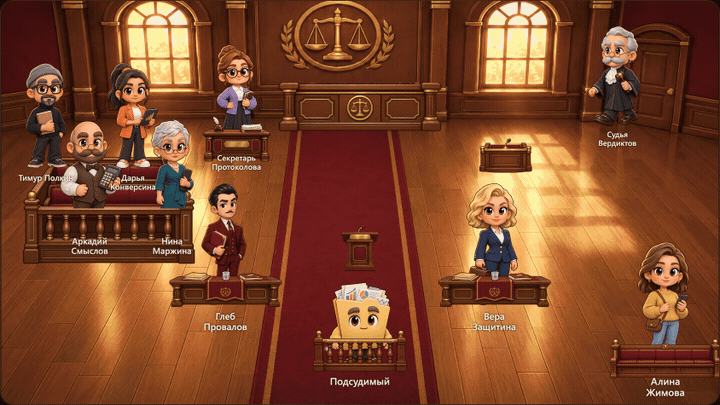

<sub>A real hearing, replayed: every line in the speech bubbles was written by the models. The interface is in Russian.</sub>

<p><a href="README.ru.md">Русская версия</a></p>

</div>

---

## Why a courtroom?

Asking one model "is this ad good?" gets you one polite opinion. Verdict sets up an adversarial process instead:
a **prosecutor** hunts for reasons the campaign will fail, a **defense attorney** argues for it, a **witness** reacts
as a typical member of the target audience, and **jurors** — experts picked for this particular material — weigh both sides.
They argue over several sessions, change their scores only when an argument actually convinces them, and a **judge**
who never took part in the debate writes the verdict. The final score is computed by code from everyone's scores,
not made up by a model.

## How a case goes

### 1. File the case

Drag a file onto the defendant's bench or paste text. Images, videos (MP4, MOV, WebM), PDF, DOCX and plain text are supported.

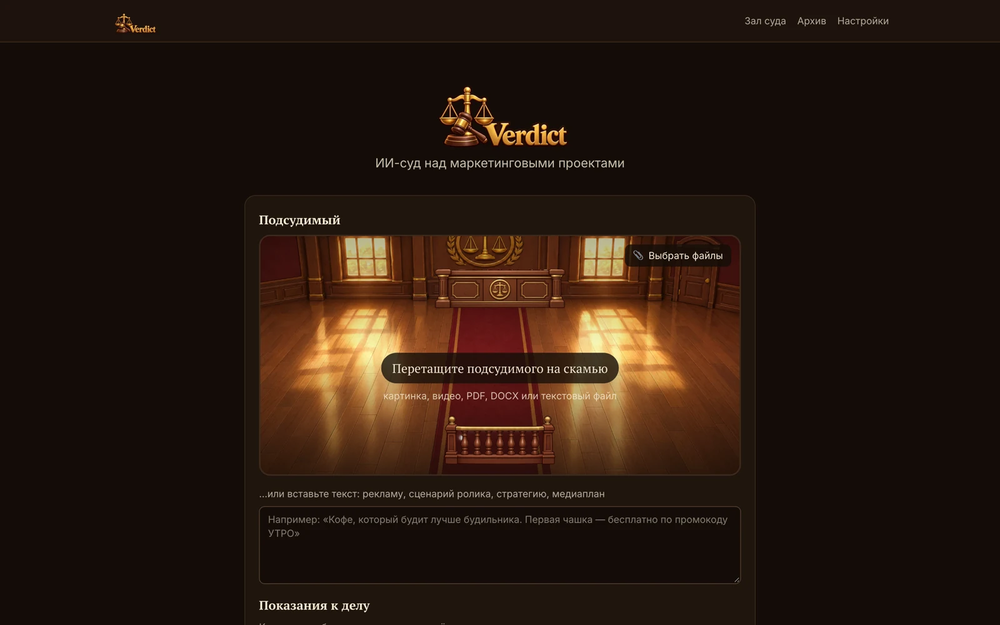

### 2. The secretary prepares the case and picks the court

The secretary reads the material — PDFs and documents as text, images through vision models, videos as a storyboard
with key frames and a transcript — then writes a summary, lists key facts and casts the court: names, characters and
the jurors' specializations depend on the material. Everything is editable before the hearing, including which model
plays each role.

<table>
  <tr>
    <td width="50%">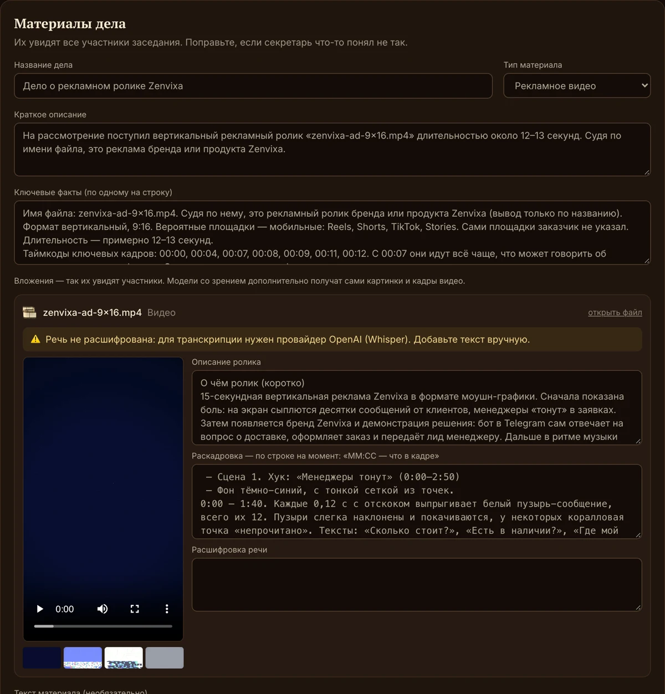</td>
    <td width="50%">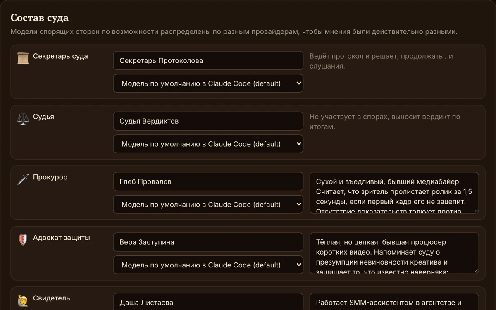</td>
  </tr>
  <tr>
    <td align="center"><sub>A video ad turned into a storyboard the models can argue about</sub></td>
    <td align="center"><sub>The court is cast for the material; every participant can run on a different model</sub></td>
  </tr>
</table>

### 3. The hearing

The first session is blind — everyone writes their opinion independently. Then the debate: each participant sees the
others' positions, answers them by name and either changes their score or explains why they didn't. After every session
the secretary decides whether new arguments were raised; the court adjourns when the arguments run out or the scores converge.
You watch it all as a courtroom scene with speech bubbles, emotions and a live chart of the scores — or switch to fast mode
and just read the transcript.

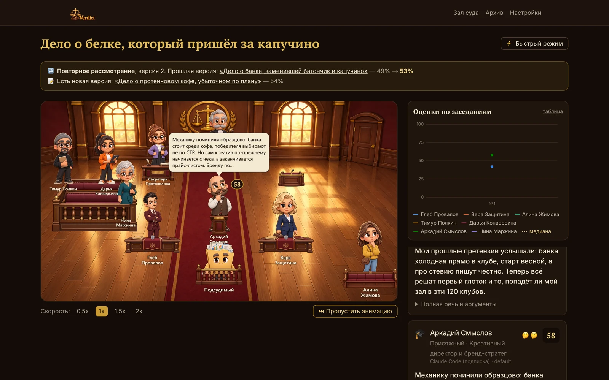

<table>
  <tr>
    <td width="50%">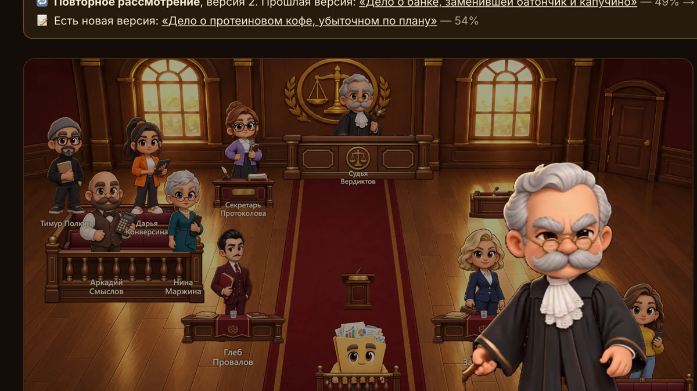</td>
    <td width="50%">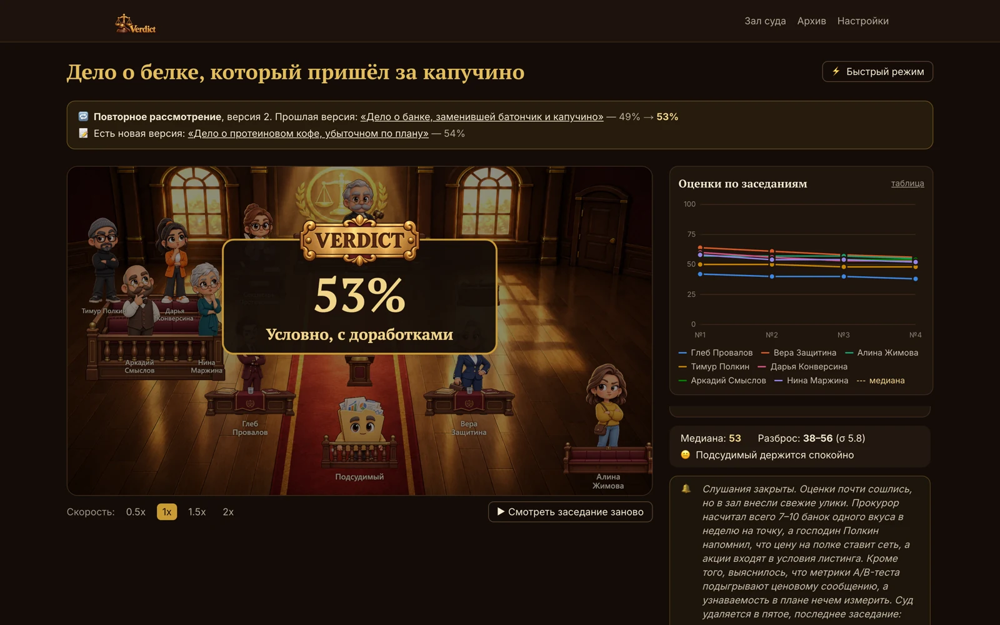</td>
  </tr>
</table>

### 4. The verdict

The success probability is a weighted median of the final scores, with the spread of opinions next to it — the judge
can't overrule the math, and the confidence can't be higher than the disagreement allows. Alongside it: a solemn speech,
a plain-language summary, target audiences with how well each one fits, risks, dissenting opinions and a list of concrete
changes ranked by impact and effort, with the ones that block the launch marked separately.

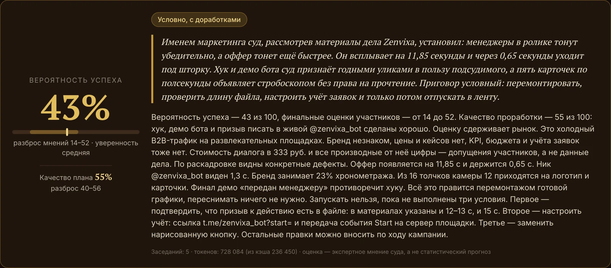

<table>
  <tr>
    <td width="50%">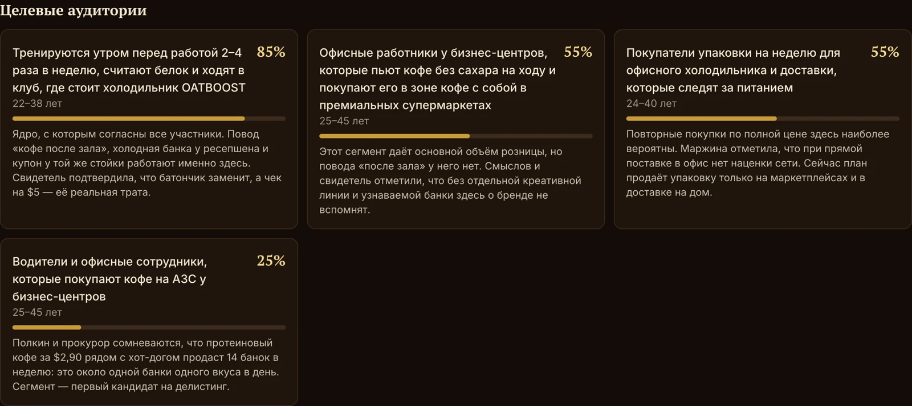</td>
    <td width="50%">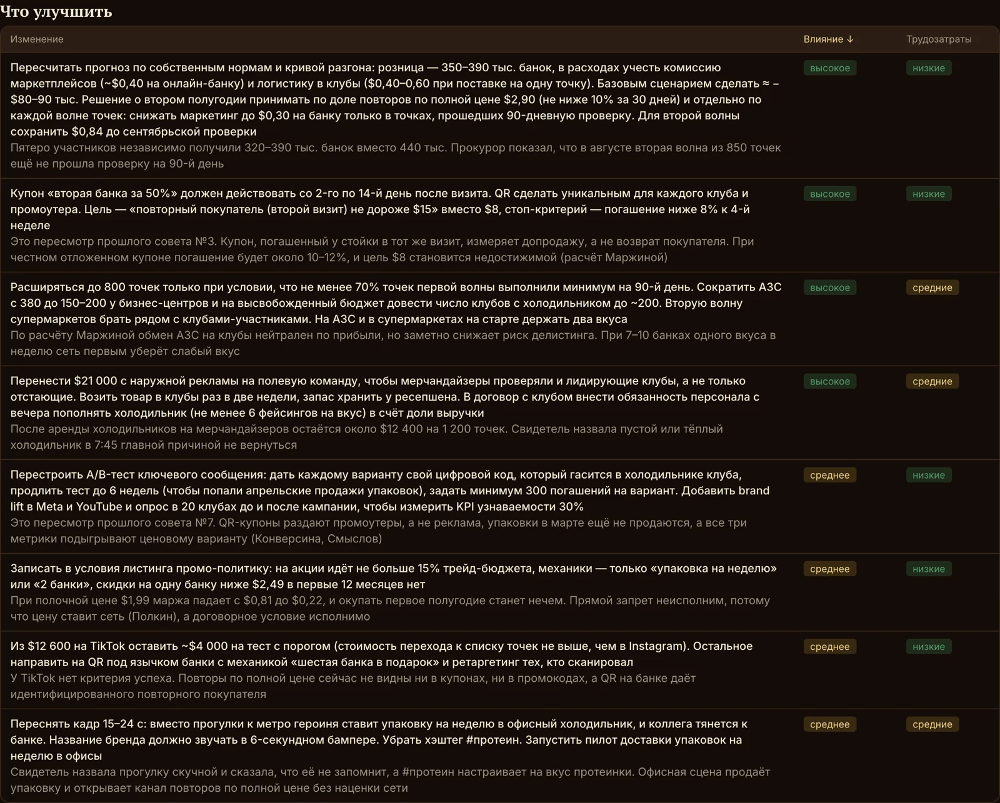</td>
  </tr>
</table>

### 5. Come back with the next version

Reworked the material after the verdict? Submit the new version — or just upload it, and the court will notice the similar
case in the archive. The same court gets its previous verdict, the secretary compares the versions and checks which advice
was followed, and the judge has to answer for **every** piece of past advice: still stands, done, revised or withdrawn.
If the court changes its mind, it has to say so and explain why — no silent contradictions between verdicts.

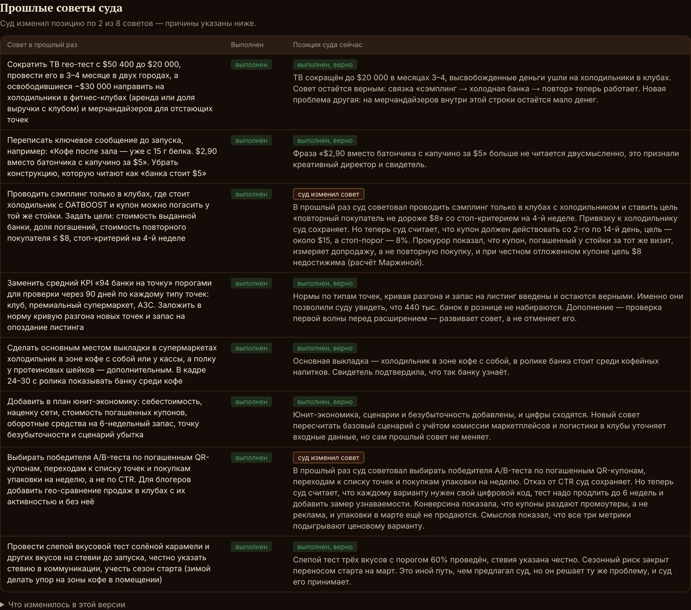

## Features

- ⚖️ **Adversarial multi-model trial** — prosecutor, defense, witness and 2–4 expert jurors, a secretary running the
  hearing and an independent judge; each role can use a different provider so the opinions really differ
- 🎬 **Animated courtroom** in PixiJS with 16 characters, emotions, cutaway videos and a replay
- 📊 **Two scores** — the chance of success and the quality of the plan — and calculations done by code, so the
  participants argue about assumptions rather than arithmetic
- 🎯 **Appeals** — a short re-hearing for one specific audience with advice tailored to it
- 🔁 **Re-review** — the court remembers its past verdict and is held to its own advice
- 📁 **Archive** with search, the forecast next to the real result (CTR, conversion, sales), export to Markdown and PDF
- 💸 **Token-aware** — shared prompt prefixes are cached by the providers, and the report shows how much was read from cache

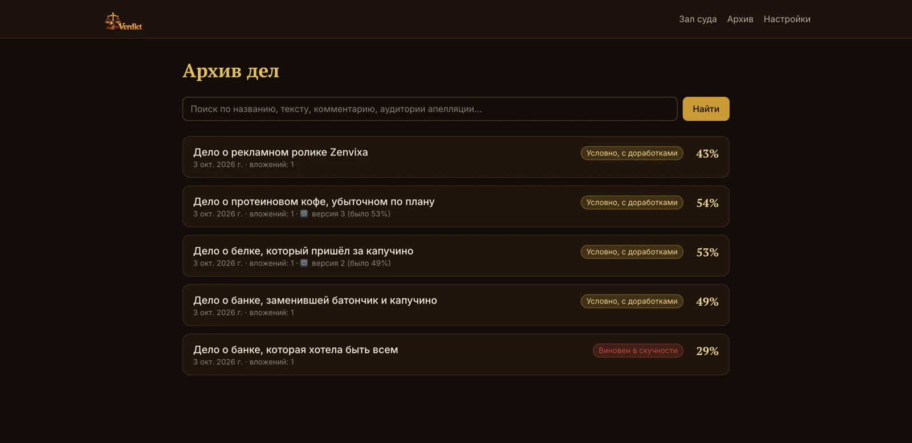

## Models

| Provider | What you need |
|---|---|
| **Anthropic / OpenAI / Gemini** | An API key |
| **OpenRouter** | Sign in from the settings page (OAuth) — the key is created for you |
| **Ollama** | Local models: `ollama pull llama3.2`, `ollama serve` |
| **Claude Code** | Your Claude subscription: `npm i -g @anthropic-ai/claude-code`, `claude auth login` |
| **Codex CLI** | Your ChatGPT subscription: `npm i -g @openai/codex`, `codex login` |
| **Gemini CLI** | Your Google account: `npm i -g @google/gemini-cli`, then run `gemini` |
| **Demo** | Nothing — plays a believable trial without any model, to try the interface |

The CLI bridges run the installed program as a separate process with no tools, no access to your files and no saved sessions.
Using a subscription through third-party apps is governed by the provider's terms — check them yourself.

## Quick start

Requires Node.js 20.9+. For videos without Gemini, also `ffmpeg` in `PATH`.

```bash
npm install
npm run dev
```

Open http://localhost:3000 → **Settings** and connect a provider (or add the **Demo** one to try it for free).
Everything stays on your machine: cases, uploads and encrypted API keys live in `./data`.

```bash
npm test           # tests, no real API calls
npm run typecheck
npm run lint
```

## Under the hood

- **Next.js 16** (App Router), **TypeScript**, **Tailwind 4**, **Motion**
- **SQLite** via drizzle + better-sqlite3; API keys encrypted with AES-256-GCM
- **PixiJS 8** for the courtroom; transparent WebM loops for the cutaways
- One adapter interface for every provider; structured JSON answers validated with **zod**, with a retry that shows the model its own error
- The trial engine is plain TypeScript: rounds, stop rules and score aggregation are code, the models only argue
- All prompts live in [`prompts/`](prompts) as Markdown and are re-read on every call — edit them without restarting
